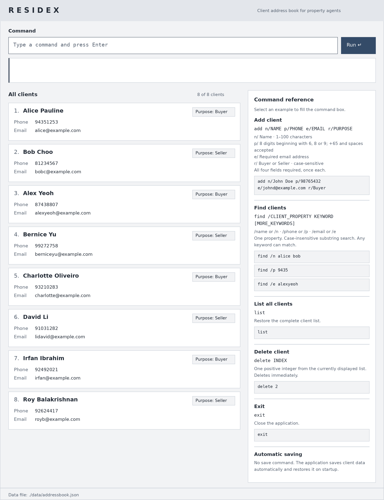

**RESIDEX** is a desktop application for property agents who manage buyers and sellers.

* Keep each client's contact details, purpose (buyer or seller), requirements, viewings, and follow-ups in one place instead of spreading them across notes and spreadsheets.
* Find and filter clients by name, contact details, or category when preparing for a viewing or a follow-up.
* Most tasks are done by typing commands. A GUI shows the current client list and the result of each command.
* If you want to use or develop RESIDEX, see the **[RESIDEX Product Website](https://ay2627s1-cs2103t-w11-4.github.io/tp/)**.

This project is based on the [AddressBook-Level3](https://github.com/se-edu/addressbook-level3) project created by the [SE-EDU initiative](https://se-education.org).
