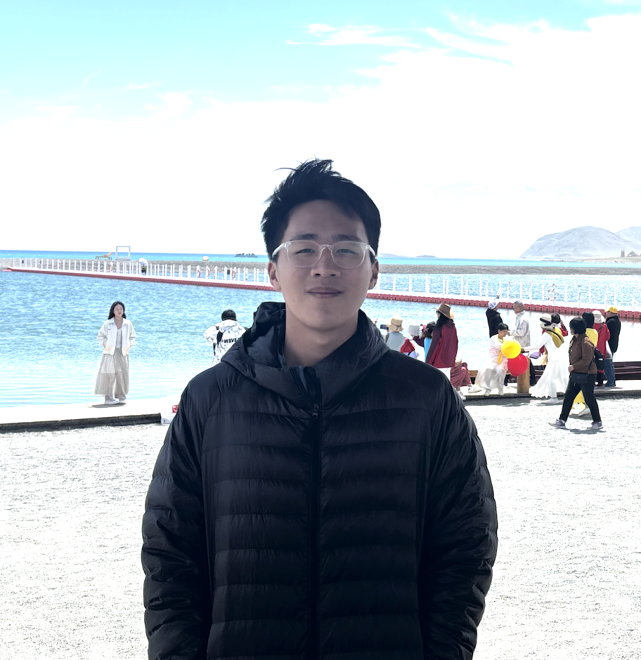
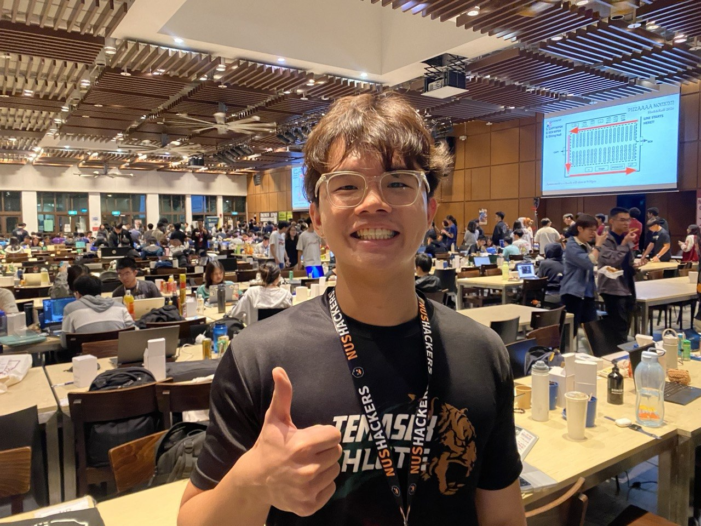
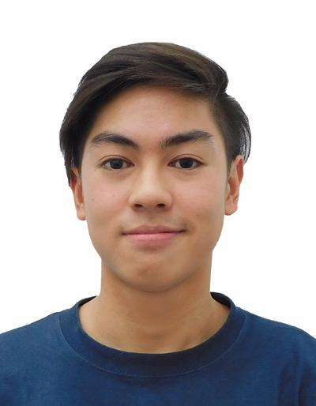
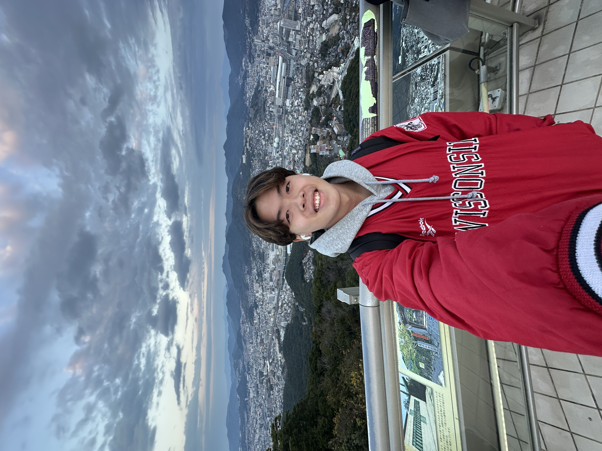

# About Us

We are a team based in the [School of Computing, National University of Singapore](http://www.comp.nus.edu.sg).

You can reach us at the email `seer[at]comp.nus.edu.sg`

## Project team

### Sylvester Lim

[[github](https://github.com/Sea1vester)]

* Role: Developer
* Responsibilities: Documentation

### Lim Kai Hui Brendan

[[github](http://github.com/brendan-lim)]

* Role: Team Lead
* Responsibilities: UI

### Ray

[[homepage](https://rayyngg.github.io)] [[github](https://github.com/rayyngg)] [[portfolio](https://rayyngg.github.io/tp/)]

* Role: Developer
* Responsibilities: Data

### Sean Tan

[[github](https://github.com/sntan1214)]

* Role: Developer
* Responsibilities: Dev Ops + Threading

### James Doe

[[github](http://github.com/johndoe)]
[[portfolio](team/johndoe.md)]

* Role: Developer
* Responsibilities: UI
